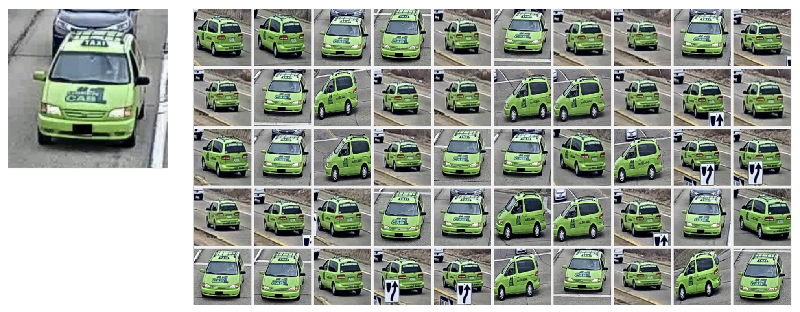
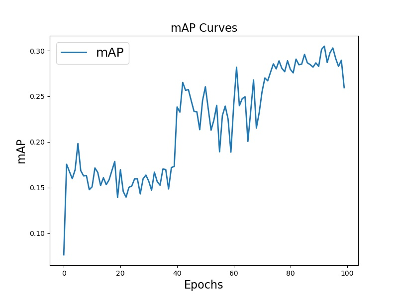

# Vehicle-ReID

## NOTE

Vehicle re-identification using ResNet as base combined with IBN-Net. This results in great ReID mAP even with extreme dataset like AICITY 2020 Track 3, which the vehicles are small and blurry.

## What does it do?

Given query vehicle image and a bunch of gallery vehicle images, our method can match the query vehicle image to the top 50 gallery vehicle images.

## Usage

### Prereqs

* Graphics Card: 1080Ti
* System: Ubuntu 18.04
* conda environment: environment.yml
* `conda env create -n reid -f environment.yml`

### Data

We use data provided by AICITY 2020 Track 3 a competition held by NVIDIA. You can get the data [here](https://www.aicitychallenge.org/2021-data-and-evaluation/) by participating in the competition. After getting the data, create a folder `Data` in this repository and put the data into this folder.

### Applying Vehicle-ReID

#### Step 1: Preprocess

1. Get the data from AI City Challenge website: https://www.aicitychallenge.org/2020-data-and-evaluation/
2. `cd precrocess`
3. Change the path of data in `path.py`
4. Execute `prepare_frame.py`, `extract_vehicle.py` and `extract_test.py` in order

#### Step 2: ReID

1. Change some settings in `options.py`
2. Execute `train_reid.py`
3. You will get the reid model in `checkpoints`

## Results

